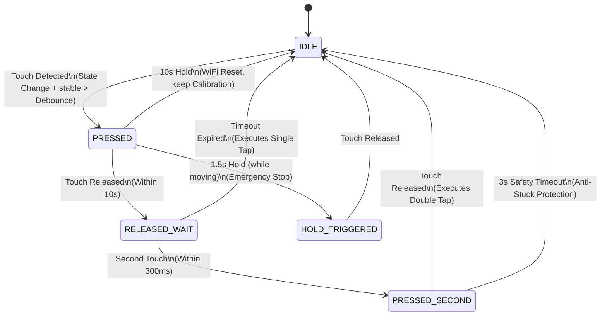

# Smart Blinds Controller: Deep-Dive Technical Analysis
## Comprehensive Engineering Review & Architectural Deep-Dive (Master Edition)

Welcome to the definitive architectural and engineering review of the **Smart Blinds Controller**—an ultra-premium, smart blinds automation system. Built from the ground up to merge precision physical actuation with modern wireless protocols, cloud voice assistant integration, and cross-device automation intelligence, this project represents a highly optimized solution for residential IoT engineering.

At its core, the controller replaces standard, noisy, manual blind chains with a whisper-quiet, highly precise stepper motor system driven by an **ESP32-C6 SoC**. Operating under an advanced Real-Time Operating System (FreeRTOS) environment, it leverages native **Wi-Fi 6 (with Target Wake Time)**, **Bluetooth Low Energy (BLE 5.0)**, thread-safe FreeRTOS control loops, cloud voice control, local solar positioning engines, a fail-safe dual-slot atomic storage system, and a first-of-its-kind **Radar Suppression State Machine** that coordinates dynamically with smart light switches to prevent false motion triggers.

This document provides an exhaustive, component-level analysis of the controller’s hardware, software, scheduling engines, network robustness, and safety systems, serving as the official technical blueprint for the project.

---

## 1. Hardware Architecture & Electronic Interface

The controller is designed around a compact, high-efficiency electronic blueprint optimized for integration into standard window casing boxes.

```
                  +-----------------------------------------+
                  |            ESP32-C6 SoC                 |
                  |     (RISC-V 32-Bit, Wi-Fi 6, BLE 5.0)   |
                  +--------------------+--------------------+
                                       |
        +------------------------------+------------------------------+--------------------+
        | (UART/GPIO Control)          | (I2C Bus)                    | (GPIO Signal)      | (WebSocket Cloud)
        v                              v                              v                    v
+---------------+              +---------------+              +---------------+    +---------------+
|    TMC2209    |              |   OpenWeather  |              |    TTP223     |    |   Sinric Pro  |
| Stepper Driver|              |  Time/Weather |              |  Capacitive   |    | Cloud Voice   |
| (SilentStep)  |              |  Sync Engine  |              | Touch Sensor  |    | (Alexa/Google)|
+-------+-------+              +---------------+              +---------------+    +---------------+
        |                              ^                              |
        v                              | (MQTT Sync)                  v
+---------------+              +-------+-------+              +---------------+
| Stepper Motor |              |  Smart Light  |              | Touch Gesture |
| (Whisper Quiet|              |    Switch     |              |      FSM      |
|   Roll-Up)    |              |  (mmWave      |              | (Decel/E-Stop)|
+---------------+              |  Radar Sensor)|              +---------------+
                               +---------------+
```

### 1.1 Microcontroller: ESP32-C6 Super Mini
The controller utilizes the **ESP32-C6**, featuring a high-performance 32-bit RISC-V single-core processor running at 160 MHz. Equipped with 4MB of onboard Flash and 512KB of SRAM, it natively supports **Wi-Fi 6 (802.11ax)**, **Zigbee 3.0**, **Thread (802.15.4)**, and **Bluetooth 5 (LE)**. This unlocks excellent wireless power efficiency, range, and mesh-networking capabilities.

### 1.2 Actuation System: TMC2209 & AccelStepper
- **Driver**: **TMC2209 Stepper Driver** operating in Standalone Mode.
  - **Pinout Configuration**:
    - `PIN_STEPPER_EN` (GPIO2 - Active LOW)
    - `PIN_STEPPER_STEP` (GPIO4)
    - `PIN_STEPPER_DIR` (GPIO5)
  - **SilentStep & StealthChop2**: Minimises magnetic motor hum, delivering virtual silence during blind movement.
  - **Pulse Width Optimisation**: Explicitly set to a minimum pulse width of 20µs (`_stepper.setMinPulseWidth(20)`) to ensure the driver reliably registers every step pulse at maximum motor torque, preventing missed steps under heavy loads.
- **Ramping Profiles**: Integrates the **AccelStepper** library, applying a mathematically smooth acceleration/deceleration trapezoidal curve (configurable up to 8,000 steps/s²). This avoids sudden mechanical jerks, preserving the structural integrity of the blind cords, gears, and casing.
- **High-Priority RTOS Stepper Timer**: Operating in an RTOS environment, the controller bypasses standard `loop()` latency by establishing a high-precision periodic hardware timer running at **20 kHz** (every 50µs) via the `esp_timer` API. To ensure thread safety, a FreeRTOS Semaphore (`_stepperMutex`) coordinates step execution, gracefully dropping single ticks rather than blocking the CPU if the lock is held.

### 1.3 Power Delivery & Regulation Architecture
The physical power routing is designed for reliable direct USB-C mains-tethered operation:
- **Energy Source**: Powered directly by a standard **5V / 2A USB-C DC input adapter**.
- **Mains Input Protection**: Employs a low-leakage TVS diode and resettable fuse to protect the internal circuitry against over-voltage spikes and current faults.
- **Power Regulation**:
  - The direct 5V input drives the high-torque TMC2209 stepper driver rail directly.
  - An **AMS1117-3.3 Low Drop-Out (LDO) regulator** derives a highly stable, low-noise **3.3V rail** to power the ESP32-C6 SoC and TTP223 capacitive touch elements.
  - All grounds (USB-C, LDO, ESP32, and peripherals) connect to a single, continuous ground plane to mitigate electrical noise and switching EMI.

---

## 2. Local Touch Gesture Decoding & Capacitive Touch FSM

A **TTP223 capacitive touch sensor** is mapped to `PIN_TOUCH` (GPIO21 - Active HIGH), converting the window trim or blind frame into a touch-sensitive button. To decode this simple high/low electrical reading into complex, intuitive user commands, the controller runs a dedicated **Finite State Machine (FSM)**.



### 2.1 The Touch States and Gestures
1. **IDLE**: The system remains at rest, scanning the digital pin. The raw readings are passed through a strict digital debounce filter (`DEBOUNCE_DELAY = 50ms`) to eliminate spurious noise or EMI from the stepper motor.
2. **PRESSED**: When a touch is validated, the FSM transitions to PRESSED and records the start time.
   - **Emergency Stop (1.5s Hold)**: If the blinds are currently moving, holding the touch sensor for 1.5 seconds (`HOLD_THRESHOLD`) triggers an immediate **Emergency Stop** (`stepperManager.emergencyStop()`). This halts the stepper instantly, bypasses the deceleration ramp, cuts motor driver power to prevent motor strain, commits the halted coordinate to EEPROM, and publishes an MQTT alarm.
   - **Wi-Fi Rescue Reset (10s Hold)**: If the sensor is held for 10 seconds, the system stops the motor, sets `config.setup_complete = false`, clears only the Wi-Fi SSID/password from EEPROM, and restarts. This boots the device into BLE Setup Mode. **Crucially, it preserves the mechanical travel limits**, so the user can change routers without having to re-calibrate their blind limits.
3. **RELEASED_WAIT**: If the touch is released quickly, the FSM enters a 300ms double-tap window (`DOUBLE_TAP_TIMEOUT`). If no second touch occurs before expiration, the FSM executes a **Single Tap** and resets to IDLE.
   - **Single Tap Action**: Gracefully toggles the blind state. If the blinds are moving, they decelerate smoothly to a stop using the configured ramp profile. If they are stationary, they travel in the opposite direction (opens if <50% closed, closes if >=50% open).
4. **PRESSED_SECOND**: If a second touch is registered within the 300ms window, it is processed as a **Double Tap**.
   - **Double Tap Action (Instant Reverse)**: If the motor is moving, the system calculates the reverse direction, executes an `instantStop()` (which halts pulses instantly but keeps the motor enabled), and immediately drives the stepper in the opposite direction. This permits rapid manual adjustments with zero lag.
   - **Stuck State Recovery**: If the second touch is held indefinitely or suffers electrical noise, a **3-second safety timeout** (`PRESSED_SECOND_TIMEOUT`) forces a transition back to IDLE to prevent the sensor from appearing unresponsive.
5. **HOLD_TRIGGERED**: Once an Emergency Stop is executed, the FSM remains locked in this state until the user physically lifts their finger, preventing accidental double-triggers or Wi-Fi resets from a single long hold.

> [!TIP]
> **Tension Relief Bypass**: If the user taps the sensor while the motor is in the "relax" phase (performing tension relief), the system immediately halts the relax phase (`stopRelax()`), cancels the speed restriction, and processes the user's command as if the motor were idle. This keeps the touch interface feeling highly responsive.

---

## 3. Asynchronous Network & Advanced Power Management

To operate reliably on USB-C power, the controller incorporates high-efficiency hardware and software protocols.

### 3.1 Wi-Fi 6 Target Wake Time (TWT)
Taking full advantage of the ESP32-C6's 802.11ax radio, the controller features **Target Wake Time (TWT)**.
- **The Mechanic**: TWT allows the controller to negotiate a sleep/wake schedule with compatible Wi-Fi 6 access points. Instead of waking up every few milliseconds to listen for beacon frames (which is unnecessary for a mains-powered device, but provides optimal network hygiene), the radio remains powered down for scheduled intervals.
- **Power Efficiency**: Reduces standby current consumption down to micro-amperes, while remaining capable of waking up instantly upon local touch events, scheduled automations, or coordinated MQTT commands.

### 3.2 Asynchronous Network State Machine
To guarantee that network latencies or disconnects never block physical motor safety routines, the controller runs an asynchronous, non-blocking connection manager (`AsyncNetwork`):
- **Non-Blocking Reconnects**: Uses an internal state register (`IDLE` -> `WIFI_OFF` -> `WIFI_ON` -> `CONNECTING`). If internet dropouts occur, the driver executes back-off reconnects and hardware power cycles in the background, keeping the main loop running smoothly.
- **Dual-Protocol Time Synchronization**: Synchronises local POSIX time using two separate channels:
  1. **Network Time Protocol (NTP)**: Standard pool queries.
  2. **HTTP-based Time Parsing (Failover)**: If firewalls block UDP port 123 (NTP), the controller executes an HTTP HEAD request to a standard server and extracts the epoch time from the HTTP header. This ensures the scheduling engine always knows the exact time of day, even on highly restricted networks.

---

## 4. Voice Assistant Integration & SinricPro Cloud Interface

The controller features cloud-native integration with **Google Home** and **Amazon Alexa** voice assistants via a dedicated, rate-limited connection manager (`SinricManager`).

```
+------------------+                   +------------------+                   +--------------------+
|  Google / Alexa  | --(Voice Cmd)-->  | SinricPro Cloud  | --(WebSockets)--> |  Blinds Controller |
|   Smart App      |                   |   AWS Backend    |                   | (Rate-Limited 50ms)|
+------------------+                   +------------------+                   +---------+----------+
                                                                                        |
                                                                                        v
                                                                              +---------+----------+
                                                                              |  StepperManager    |
                                                                              | (Direct Actuation) |
                                                                              +--------------------+
```

### 4.1 Supported Voice Controls
By registering as a `SinricProBlinds` device type, the controller supports a variety of natural voice instructions:
- **Absolute Positioning**: *"Hey Google, set the living room blinds to 60%"* or *"Alexa, open bedroom blinds"* (coordinates are mapped linearly to physical motor steps).
- **Relative Adjustments**: *"Hey Google, open the blinds a little"* or *"Alexa, close bedroom blinds a little"* (adjusts position in ±25% increments and returns the actual resulting percentage to the cloud).

### 4.2 Cloud Synchronisation
- **Bi-Directional Telemetry**: When the blinds are moved manually (via the local touch sensor, automatic calendar schedules, or the local PWA app), `sinricManager.reportPosition()` immediately updates the SinricPro cloud. This ensures the Alexa/Google Home app always reflects the exact, real-time position of the blinds.
- **Boot Sync**: Upon initial boot or recovery, the manager queries the physical stepper motor position and syncs it with the cloud to align the digital representation with reality.

> [!IMPORTANT]
> **Responsiveness Fix**: The WebSocket processing for cloud commands can block the main loop for 100-500ms if the connection is slow. To prevent this from degrading local touch responsiveness and causing delayed button actions, the system rate-limits calls to `SinricPro.handle()` to once every **50ms**. This maintains smooth voice response while keeping local touch gesture decoding instantaneous.

---

## 5. Cross-Device Symphony: The Blinds & Switch Link

One of the controller’s most advanced features is its seamless integration with the **Smart Light Switch** (an ESP32-C6 wall switch featuring a high-precision **LD2410C mmWave Radar**). Coordinated over MQTT, they perform two critical, synchronized operations:

```
[Blinds Controller]                                     [Smart Light Switch]
        |                                                        |
        | --- 1. Motor Starts Moving (MQTT) -------------------> |
        |     Request: Switch to MANUAL Mode                     |
        |                                                        |
        | <--- 2. Acknowledge Mode Change (MQTT) --------------- | (Radar Suppressed)
        |                                                        |
        | === Whisper Quiet Stepper Operation (Moving Blinds) ===
        |                                                        |
        | --- 3. Motor Stops + 45s Cooldown Ends --------------> |
        |     Request: Restore AUTO Mode                         |
        |                                                        |
        | <--- 4. Acknowledge Mode Change (MQTT) --------------- | (Radar Re-enabled)
        |                                                        |
        | ====================================================== |
        | === 5. Morning Gradual Open Completes ================ |
        | --- Tell Switch to Exit Bedtime Mode (MQTT) ---------> | (Session Closed)
```

### 5.1 The Radar Suppression State Machine
High-sensitivity mmWave radar sensors (like the LD2410C) are capable of detecting micro-movements, including breathing. Consequently, the mechanical movement of motorized roller blinds is registered by the sensor as human presence, which would normally trigger light switches and disrupt room occupancy metrics.

The controller solves this with a **dynamic suppression protocol**:
1. **Initiation**: The moment the motor starts moving, the internal state machine detects `isMoving() == true` and `_wasMoving == false`.
2. **Suppression Request**: If the linked light switch is in `AUTO` mode and the room lights are off, the controller publishes an MQTT payload targeting the light switch: `{"mode": 1}` (MANUAL). This instructs the switch to temporarily ignore all radar readings.
3. **ACK & Retry Protocol**: To guarantee transmission safety over wireless networks, the controller runs a 3-retry ACK loop. If the light switch does not publish a state confirmation within 2 seconds, the controller re-sends the command.
4. **Hysteresis & Cooldown Restore**: When the blind reaches its target and stops, a **45-second stabilization cooldown timer** starts. This ensures the physical blind fabric has entirely stopped swaying and settling before the controller publishes `{"mode": 0}` (AUTO) to restore the light switch's radar sensitivity, achieving zero false-occupancy triggers.

### 5.2 Waking-Hour Bedtime Sync
At night, the light switch enters **Bedtime Mode** (which records sleep sessions, turns off the display, and disables motion lights).
- **The Problem**: The switch blocks standard external mode changes during sleep to prevent accidental wake-ups from other smart devices.
- **The Solution**: When the controller finishes its gradual morning opening routine, it sends a specialized MQTT command: `{"sleep": false}`. Because this is a dedicated sleep termination instruction, the switch accepts it, safely wraps up the sleep tracking session, closes the data logs, and transitions back to standard operational mode—waking up the room in perfect sync.

---

## 6. Intelligent Automation & Multi-Day Scheduling Engines

The controller runs five separate, highly tunable scheduling engines.

| Automation | Sensor Source | Action / Trigger | User Safeguards |
|---|---|---|---|
| **Morning Wake-Up** | Internal Real-Time Clock (NTP/POSIX) | Gradual opening over a custom duration (e.g., 30 mins) to simulate sunrise. | **"Only-Go-Up"** (never closes during wake-up) & **Manual Override Abort** (stops on manual touch/app changes). |
| **Sunset Auto-Close** | Weather API Coordinates | Closes blinds to target position based on dynamic, daily-calculated sunset. | Configurable positive/negative offset in minutes (e.g., sunset + 15 mins). |
| **Night Lock** | Internal POSIX Calendar | Closes and locks blinds at a specified hour on designated days. | Custom weekday/weekend day-of-week bitmasks. |
| **Presence Sync** | Coordinated MQTT Telemetry | Auto-opens when room is occupied; auto-closes when room is vacant. | **3-Count Vacancy Hysteresis** & **2-Second Motion Debounce** to prevent unnecessary jitter. |
| **Thermal Shield** | Linked Device Temperature | Lowers blinds to block solar radiation when room temperature spikes. | 15-minute cool-down timer to prevent cycling under thermal oscillation. |

### 6.1 Gradual Sunrise Simulator (Morning Wake-Up)
Instead of shocking the user awake with sudden light and noise, the controller features a highly configurable, multi-day morning routine:
- **Custom Schedule Profile**: Supports unique configurations per day of the week (using a `morning_days` bitmask). Each day has a unique target time (HH:MM), a target opening percentage, and a gradual duration (up to 120 minutes).
- **Quantized Step Progression**: Calculates elapsed time and smoothly moves the blind in micro-steps quantized to 1-minute intervals.
- **"Only-Go-Up" Safety Guard**: Ensures the blind never travels downward during a morning open sequence, preventing sudden darkness due to arithmetic rounding or configuration adjustments.
- **Manual Override Abort**: Continuously monitors user commands. If the user touches the local capacitive sensor or moves the blind via the mobile app during the morning window, the controller immediately aborts the sunrise routine, relinquishing control to the user.

### 6.2 Solar Sunset Tracker
The controller fetches geographic coordinates and local weather data from OpenWeatherMap APIs. It automatically parses daily sunrise/sunset times and translates them into local epoch timestamps. The sunset routine executes at the exact calculated time, modified by a user-configured offset (e.g., close exactly 20 minutes after sunset) to perfectly align with seasonal shifts without manual adjustments.

### 6.3 Hysteresis-Filtered Presence Control
When linked to a mmWave presence sensor, the controller dynamically controls privacy. To prevent the blinds from constantly raising and lowering as people briefly enter or exit the room, the system implements:
- **Motion Debounce (2 seconds)**: Requires continuous motion detection for 2 full seconds before raising the blinds.
- **Vacancy Hysteresis (3 counts)**: Requires 3 consecutive "empty" readings (over a configured time window) before confirming the room is vacant, ensuring the blinds don't close on someone reading quietly or staying still.

---

## 7. Failsafe Atomic EEPROM Storage & Flash Protection

The controller incorporates a highly resilient, storage manager (`StorageManager`) designed to protect physical flash sectors and guarantee data integrity across arbitrary power outages.

### 7.1 Flash Wear Mitigation & Write Throttling
ESP32 flash memory is typically rated for only 100,000 write cycles. Unregulated configuration updates would rapidly brick the chip. The controller implements a dual-layer protection system:
- **Save Throttling**: A strict 2-second rate limiter (`MIN_SAVE_INTERVAL_MS = 2000`) delays consecutive physical flash writes, staging updates in RAM first.
- **Dirty Checking (CRC32 Checksum)**: Before executing a save, the system runs an **IEEE 802.3 CRC32 checksum** calculation over the current settings. If the computed checksum matches the last written checksum, the system aborts the write, resulting in **zero unnecessary flash cycles**.

### 7.2 Atomic Transactional Commit with Power-Loss Recovery
Power outages during a flash write are the primary cause of corrupted settings in IoT devices. The controller solves this with a **transactional, dual-slot fail-safe commit scheme**:

```
 [Configuration Update Initiated]
                |
                v
  1. Copy current configuration from primary slot to [BACKUP SLOT]
                |
                v
  2. Write transactional flag [0xDEADBEEF] to [WRITE_FLAG_ADDR]
                |
                v
  3. Write new configuration to [PRIMARY SLOT]
                |
                v
  4. Execute EEPROM.commit() (Physical sector write)
                |
                v
  5. Read Primary Slot back and verify CRC32 Checksum
         /                              \
   [Valid Checksum]              [CORRUPT CHECKSUM]
         |                              |
         |                              v
         |                        5a. Restore from [BACKUP SLOT]
         |                        5b. Commit and write back to Primary
         |                              |
         \                              /
          \                            /
           v                          v
  6. Clear transactional flag to [WRITE_FLAG_CLEAR] and commit.
```

- **The Boot-Time Recovery Loop**: Upon boot, `storage.begin()` reads the value at `WRITE_FLAG_ADDR`. If the flag equals `0xDEADBEEF`, the device was interrupted by a power failure mid-commit, leaving the primary slot corrupt. The system instantly halts boot, pulls the verified config from the **Backup Slot**, writes it over the primary sector, clears the flag, and re-initializes, achieving **100% self-healing storage resilience**.

### 7.3 Deterministic Memory Packing & Configuration Migration
The configuration structure uses the packed attribute (`struct __attribute__((packed)) ConfigData`), forcing the compiler to bypass default memory padding. This guarantees the struct layout remains identical across different compilers and optimization levels—crucial because the raw-byte checksum covers the entire block.
Additionally, the system features a robust **Config Migration Engine** that automatically detects legacy configuration schemas (V4, V10, V11) on boot, mapping old credentials, and safely generating default parameters for newly added V12 fields (like timezone offsets, safety limits, and tension wiggles) without losing the user's active Wi-Fi settings.

---

## 8. BLE Provisioning & Headless Rescue Mode

When Wi-Fi is not configured or connection fails, the controller runs a highly capable **Bluetooth Low Energy (BLE) Provisioning and Debugging Server** powered by **NimBLE** (which reduces RAM usage by 60% compared to standard BLE libraries).

### 8.1 Web Bluetooth Setup
Using the standard BLE Service UUID `12345678-1234-5678-1234-56789abcdef0`, a web browser can connect directly to the blinds to:
- Scan for local Wi-Fi networks and display RSSI values.
- Securely upload Wi-Fi SSIDs and passwords.
- Calibrate the stepper motor limits by sending manual jog instructions over the air.

### 8.2 Headless Rescue Mode Features
If the device enters Safe Mode due to boot crashes, it boots into **Rescue Mode** and exposes a dedicated diagnostic suite over BLE characteristics:
- **Serial Log Stream**: Captures recent serial output logs in a 2KB ring buffer (`captureSerial()`) and streams them continuously over BLE.

  > [!NOTE]
  > **Congestion Mitigation**: The serial output stream is rate-limited to 200ms intervals and sliced into chunks of 128 bytes. This prevents packet loss and respects the strict BLE MTU limits on mobile devices.
- **JSON Diagnostics Stream**: Streams complete system health objects (heap, tasks, Wi-Fi, error registers) over BLE in paced 128-byte chunks (20ms delay).
- **In-App OTA Updates**: Permits uploading new firmware bin files directly over Bluetooth, bypassing the local router entirely.

---

## 9. Advanced Telemetry & Software-Based Stall Analytics

The controller includes a highly comprehensive diagnostics manager (`DiagnosticsManager`) that tracks system health and physical mechanics in real-time, storing logs in highly optimized ring buffers directly in RAM.

### 9.1 Software-Based Mechanical Stall Detection
The controller can detect mechanical blockages or physical cord failures **completely in software**, with no extra hardware components:
- **The Algorithm**: The diagnostics engine records all motor movements in a `StepperEvent` ring buffer. It stores the expected step distance (`targetPos - startPos`) and the actual step distance achieved (`endPos - startPos`).
- **Suspected Stalls Analysis**: The diagnostics manager parses the last 24 movements. If the actual travel falls below 95% of the expected target (on moves larger than 100 steps), the system flags a mechanical discrepancy, increments the `suspectedStalls` diagnostics counter, and publishes an alert to the user's dashboard.

### 9.2 Deep RTOS Diagnostics Suite
The web app exposes real-time telemetry from the controller's diagnostics endpoint:
- **Heap Fragmentation Estimate**: Automatically calculated using the formula:
  $$\text{Fragmentation (\%)} = \left(1 - \frac{\text{Maximum Allocatable Block}}{\text{Free Heap}}\right) \times 100$$
  This allows developers to detect memory leaks and fragmentation before they trigger system failures.
- **FreeRTOS Stack Monitor**: Utilises `uxTaskGetStackHighWaterMark` to monitor task memory health, tracking the exact number of unused bytes remaining in the task's stack.
- **Reset Reason Mapping**: Maps chip hardware registers (`esp_reset_reason_t`) into human-readable strings, highlighting whether a reboot was triggered by a standard power cycle, software update, watchdog timeout, panic, or brownout.
- **Sensor Analytics**: Logs capacitive touch false trigger rates dynamically (`falseTriggers / totalEvents * 100`), tracks CPU thermal metrics using the internal chip temperature sensor, and registers connection signal histories.

---

## 10. Summary of Technical Specifications

| Parameter | Specification | Details |
|---|---|---|
| **CPU Architecture** | RISC-V 32-Bit Single-Core (ESP32-C6) | 160 MHz, high performance, native Wi-Fi 6. |
| **RF Transceiver** | 2.4 GHz Wi-Fi 6 (802.11ax), BLE 5.0 | High efficiency, Target Wake Time (TWT) support. |
| **Power Management** | Direct USB-C Adapter Input | 5V / 2A direct DC input via standard adapter. |
| **Voltage Regulation** | AMS1117-3.3 LDO (3.3V) | High-stability low-power isolated logic rail. |
| **Storage / RAM** | 4MB Flash, 512KB SRAM, 2KB EEPROM | Atomic dual-slot storage with CRC32 protection. |
| **Actuator Control** | TMC2209 Standalone + AccelStepper | StealthChop2 silent operation, 20kHz timer loop. |
| **Voice Integration** | SinricPro Cloud Websocket | Google Home & Alexa Voice, rate-limited to 50ms. |
| **Stall Detection** | Software-based expected/actual check | Suspected stalls flagged if step loss exceeds 5%. |
| **Positional Precision** | 64-Bit Signed Step Range (`int64_t`) | Safe against integer overflow on high-step travel. |
| **Physical Interface** | TTP223 Capacitive Touch Sensor | Gesture FSM: Single/Double Tap, 1.5s & 10s Hold. |
| **Diagnostics System** | `DiagnosticsManager` with Ring Buffers | 6 dedicated queues tracking Wi-Fi, MQTT, Motors, Errors. |
| **Self-Healing Systems** | Safe Mode & Backup Boot Recovery | Restores configuration from backup slot on boot failure. |

---

## 11. Conclusion

The **Smart Blinds Controller** stands as a testament to thoughtful, robust smart-home engineering. By focusing on mechanical longevity (Tension Relief), power efficiency (Wi-Fi 6 TWT), system reliability (Safe Mode & Non-Blocking Async Network), cloud voice accessibility (SinricPro), and cross-device coordination (Radar Suppression), it transforms simple roller blinds into an intelligent, whisper-quiet, self-healing window management system. It represents the perfect harmony between the digital and physical worlds.
