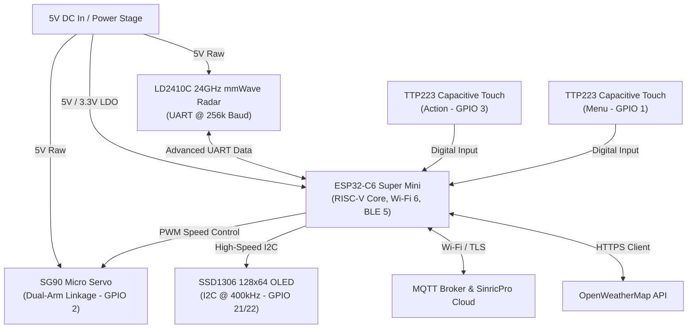
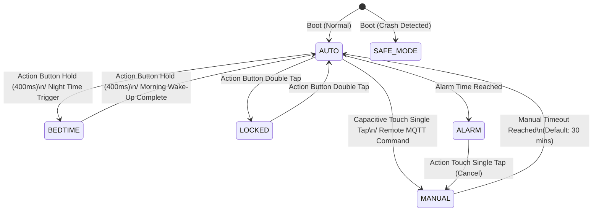
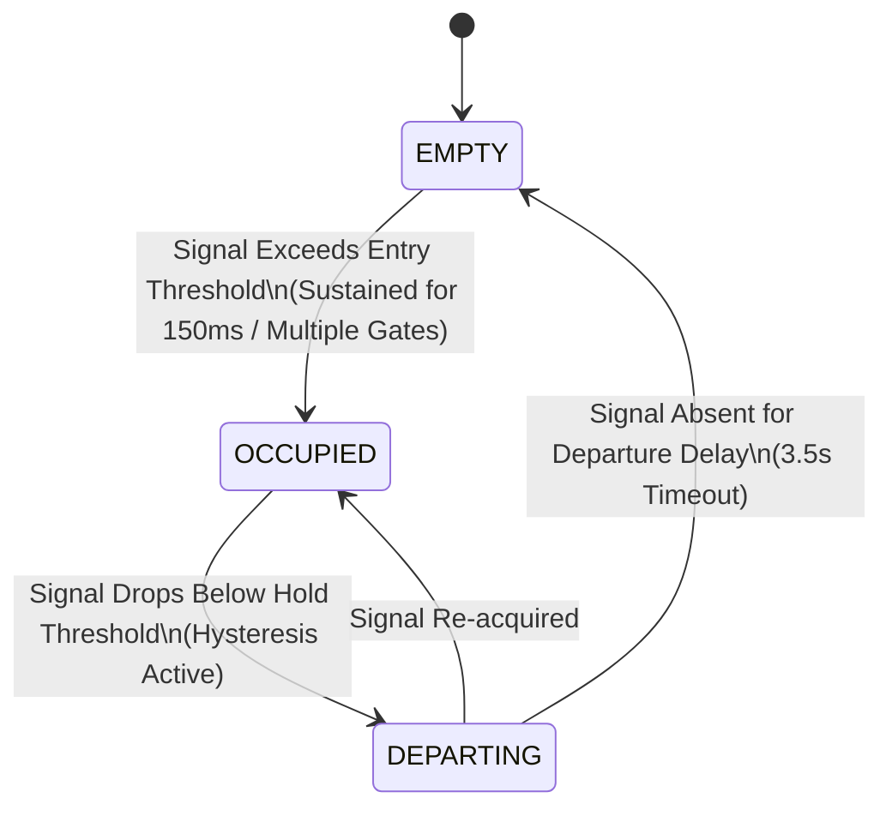

# Smart Light Switch: Deep-Dive Technical Analysis
## Deep-Dive Technical Analysis & Project Showcase

The **Smart Light Switch** is an advanced, non-invasive smart switch controller built on the **ESP32-C6** platform. Designed to fit directly over standard physical wall switches, it uses a dual-arm servo mechanism to flip switches mechanically—avoiding complex high-voltage rewiring while delivering state-of-the-art smart home capabilities.

From its advanced 24GHz mmWave radar presence detection to its circular-statistics-driven sleep chronobiology engine and multi-protocol networking, this project represents a production-grade fusion of electrical engineering, control systems, and software design.

---

## 1. System Architecture & Hardware Connections

At the core of the switch is a highly optimised component layout powered by the **ESP32-C6 Super Mini** development board, which leverages a modern 32-bit RISC-V microcontroller with integrated Wi-Fi 6, Bluetooth 5.0 (LE), and Zigbee/Thread radios.



### 1.1 Complete Wiring Specification
To prevent boot failures and pin conflicts, the switch design respects the ESP32-C6 strapping pin layout. Pins associated with boot configuration, SPI flash, or JTAG/debug functions have been bypassed in favour of dedicated safe GPIO allocations:

| Component | Model | ESP32-C6 Pin | Net / Protocol | Function |
| :--- | :--- | :--- | :--- | :--- |
| **Actuator** | SG90 Micro Servo | `GPIO 2` | PWM Output | Dual-arm switch toggle mechanical control |
| **Motion Sensor** | LD2410C mmWave Out | `GPIO 14` | Digital Input | Binary Hardware Presence signal |
| **Radar RX** | LD2410C UART RX | `GPIO 20` | UART RX (from ESP TX) | High-speed configuration & telemetry |
| **Radar TX** | LD2410C UART TX | `GPIO 0` | UART TX (to ESP RX) | High-speed configuration & telemetry |
| **Button 1** | TTP223 Capacitive Touch | `GPIO 3` | Digital Input | Action / Toggle Control (Active High) |
| **Button 2** | TTP223 Capacitive Touch | `GPIO 1` | Digital Input | Menu / Calibration Control (Active High) |
| **Display SDA** | SSD1306 OLED SDA | `GPIO 21` | I2C SDA | Data line for 128x64 visual display |
| **Display SCL** | SSD1306 OLED SCL | `GPIO 22` | I2C SCL | Clock line for 128x64 visual display |

### 1.2 Strapping Pin Analysis & Avoided GPIOs
Selecting pins for ESP32-C6 systems requires strict adherence to Espressif hardware design guidelines. The following pins are explicitly left floating or unused to maintain system reliability:
* **GPIO 8 & GPIO 9 (Strapping):** GPIO 9 controls the chip's boot mode (Low = ROM Bootloader, High = Flash Boot). GPIO 8 controls boot log output. Driving these pins externally during boot leads to boot loops or boot failures.
* **GPIO 4 & GPIO 5 (Strapping / JTAG):** Reserved as bootstrap indicators and JTAG interface lines.
* **GPIO 6, GPIO 7, GPIO 15 (Flash SPI & JTAG):** SPI lines connecting the internal Flash memory. Driving these causes SPI bus collisions and instant kernel panics on boot.
* **GPIO 18 & GPIO 19 (USB-JTAG/Serial):** Direct hardware USB lines, reserved for programmer connectivity and chip flashing.

---

## 2. System Modes & The State Machine

The switch's core behaviour is governed by a robust, deterministic state machine (`state_machine.cpp`) that coordinates interactions between physical inputs, network messages, and local time clocks.



### 2.1 Exhaustive System Modes Analysis
1. **MODE_AUTO (0 - Automated Presence):**
   * **Behaviour:** Governed by mmWave radar presence detection. The light transitions to `ON` instantly when motion/stillness is detected and fades to `OFF` after the configured `motion_timeout` expires without occupied signals.
   * **Power Optimisation:** Incorporates the `Day-Idle` mode, suppressing light-on commands during daylight hours while leaving ambient calculations active.
2. **MODE_MANUAL (1 - Temporary Override):**
   * **Behaviour:** Triggered by a physical capacitive touch or a remote MQTT / SinricPro command. The state machine suspends automated radar shut-offs, keeping the light state overridden for a customizable `manual_timeout` (default: 30 minutes).
   * **Reset Dynamics:** Subsequent touches during MANUAL mode reset the override timer back to its full length.
3. **MODE_ALARM (2 - Morning Wake-up Haptic Buzz):**
   * **Behaviour:** Triggered via schedule or NTP-synchronised alarms. In addition to turning the light state ON, the state machine triggers a **non-blocking haptic servo wiggle pattern**.
   * **Haptic Buzz Pattern:** The servo speed is increased to `100` (maximum), and the servo wiggles $\pm 2$ degrees relative to the target angle every 2 seconds for a 50ms pulse. This creates a distinct mechanical buzz that serves as an audible and physical alarm, completely avoiding CPU-blocking `delay()` calls.
4. **MODE_BEDTIME (3 - Sleep Intelligence Guard):**
   * **Behaviour:** Enforces a secure, sleep-conducive environment. Turns off the SSD1306 OLED display, blocks all motion sensor turn-on triggers, and activates the *Master Bedtime Guard*.
   * **Master Bedtime Guard:** A critical defense-in-depth safety mechanism. It rejects all light-on requests from time-based, day-idle, or stale timer routines. The guard only permits light activation from explicit, direct user actions: `TOUCH` (physical button), `MQTT` (remote API command), and morning `ALARM` schedules.
5. **MODE_LOCKED (4 - Safety Lock):**
   * **Behaviour:** Suspends all interaction. Toggling into this state freezes the current light state (either ON or OFF) and ignores all capacitive touch taps, remote toggle calls, or motion triggers. This is perfect for home maintenance, movie watching, or preventing pets from triggering switches.

---

## 3. Advanced mmWave Presence Detection Engine

Traditional passive infrared (PIR) sensors only detect lateral movement, frequently leaving users in the dark when they sit still. The switch solves this by incorporating the **LD2410C 24GHz mmWave radar** sensor, governed by a custom-designed, production-grade DSP pipeline in the `RadarManager` module.



### 3.1 Multi-Gate Sliding Window Filter
The `RadarManager` operates the LD2410C in **Engineering Mode** over a custom **256,000 baud UART link**. The sensor splits space into **9 distance gates** (each covering 75cm, for a total range of 6.75m). 
To smooth out noise without sacrificing response time, the software implements a dual-rate **sliding-window filter** calculated in $O(1)$ time complexity using running-sum ring buffers:
* **Movement Filter (3-sample window):** Captures high-frequency, sudden motions for instantaneous light triggering.
* **Static Filter (25-sample window):** Smooths micro-motions, such as chest rises from breathing, ensuring stable hold tracking even when a person is motionless.

### 3.2 Dynamic Noise-Floor & Drift Calibration
To prevent false triggers from inanimate, vibrating objects (e.g., fans, refrigerators, or blowing curtains), the switch features a two-stage calibration engine:
1. **Boot-Time Calibration:** On startup, the system captures baseline environmental noise across all 9 gates, establishing an absolute, ambient noise floor.
2. **Periodic Drift Recalibration:** Every 30 minutes of confirmed `EMPTY` state, the system averages ambient energy over 8 cycles. If the baseline has drifted (due to shifts in temperature or humidity), the thresholds automatically adapt.

### 3.3 Dual-Sensitivity Hysteresis & State-Aware Logic
To eliminate the "flicker" effect where lights toggle rapidly when a person sits on the threshold boundary, the switch integrates a dual-sensitivity hysteresis loop:
* **Lights OFF (Stricter Entry):** When the room is dark, entry thresholds are high ($Move \approx 70, Static \approx 60$ energy units). This blocks false turn-ons from minor atmospheric currents or EMI.
* **Lights ON (Relaxed Hold):** Once the light turns on, hold thresholds are reduced via a multiplier ($Hold = Entry \times hold\_multiplier$, default $40\%$). This maintains the "occupied" status even with minimal physical feedback.

### 3.4 Actuator Electro-Mechanical Shielding
When the SG90 micro-servo fires to physically toggle the light switch, its high current draw and rotating arm generate substantial electrical EMI and physical vibration. The mmWave radar would normally interpret this as human movement, causing an immediate, infinite re-trigger loop.

The switch bypasses this with **hardware-actuator synchronization**:
1. When a toggle is ordered, the `RadarManager` **pauses detection** and flushes the filter's history.
2. The servo completes its travel.
3. The system waits out a **2500ms post-light cooldown**.
4. The radar undergoes a **soft resume**, gradually recharging its accumulators, completely ignoring the mechanical toggle event.

---

## 4. Sleep Analytics & Chronobiology Engine

One of the switch's most unique features is its integrated sleep intelligence platform (`SleepManager.cpp`). Running entirely locally on the ESP32-C6, it performs sophisticated analysis on sleep patterns without transmitting private data to the cloud.

```
+---------------------------------------------------------------------------------+
|                                 SLEEP MANAGER                                   |
|                          (Local Chronobiology Engine)                           |
+---------------------------------------------------------------------------------+
|                                                                                 |
|  [Sleep Sessions]  ===>   Circular Statistics  ===>  - Consistency Score (35%)  |
|     (Max: 60)                (Midnight-Aware)        - Timing Score (15%)       |
|                                                      - Cycle Alignment (10%)    |
|                                                      - Duration Score (40%)     |
|                                                                ||               |
|                                                                \/               |
|                                                      [Sleep Quality Score]      |
|                                                             (0-100%)            |
+---------------------------------------------------------------------------------+
```

### 4.1 Midnight-Aware Circular Statistics
Calculating bedtime statistics mathematically is notoriously difficult because standard arithmetic averages fail at midnight. For example, averaging a bedtime of 11:30 PM ($23.5h$) and 12:30 AM ($0.5h$) arithmetically yields 12:00 PM ($12.0h$)—noon!

To solve this, the `SleepManager` converts bedtime timestamps into points on a unit circle using trigonometry. Timestamps are normalised around 6:00 PM ($18:00$), mapping 6:00 PM to 0 minutes and 5:59 PM to 1439 minutes:

$$\theta_i = \left( \frac{\text{Normalized Minutes}_i}{1440} \right) \cdot 2\pi$$

Using the sine and cosine averages, the **circular mean** $(\bar{\theta})$ and **circular standard deviation** $(\sigma_{\theta})$ are computed over the stack array:

$$\bar{\theta} = \operatorname{atan2}\left( \frac{1}{N}\sum_{i=1}^N \sin(\theta_i), \frac{1}{N}\sum_{i=1}^N \cos(\theta_i) \right)$$

$$\sigma_{\theta} = \sqrt{\frac{1}{N} \sum_{i=1}^N \Delta\theta_i^2}$$

Bedtime differences are wrapped correctly around the circular boundary ($\Delta\theta_i \in [-720, 720]$ minutes) to handle crossover. This mathematical model allows the switch to calculate a highly accurate **Consistency Score** ($0-100\%$) based on the user's bedtime variability (e.g., standard deviation $\le 15$ minutes scores $90-100\%$, while variation $>90$ minutes drops below $25\%$).

### 4.2 Composite Sleep Quality Score
Every morning, the chronobiology engine compiles a comprehensive **Sleep Quality Score** ($0-100\%$) based on four heavily researched scientific vectors:
1. **Duration Score (40%):** Fits actual sleep duration to a Gaussian bell curve centred on the user's target sleep goal (default: 8 hours, $\sigma = 1.2$ hours):
   $$Score_{dur} = 100 \cdot e^{-\frac{(Actual - Target)^2}{2 \cdot 1.2^2}}$$
2. **Consistency Score (35%):** Derived directly from the bedtime circular standard deviation.
3. **Timing Score (15%):** Penalises bedtimes that stray from the human body's circadian peak window (centred at 11:00 PM / $23:00$). 
4. **Cycle Alignment Score (10%):** Measures how closely the sleep duration corresponds to natural 90-minute sleep cycles, rewarding the user if they wake up at the end of a cycle (e.g., 6.0h or 7.5h) rather than mid-cycle.

### 4.3 Actionable Insights & Chronotype Classification
Based on logged data, the device provides personalised recommendations:
* **Sleep Debt Tracking:** Keeps a running tally of sleep deficit accumulated over the last 7 days compared to the sleep target.
* **Social Jet Lag Detection:** Monitors the difference between average weekday sleep and weekend sleep, warning when shifts exceed 1 hour.
* **Chronotype Classification:** Dynamically categorises users into chronotypes based on their sleep windows:
  * **Regular:** Structured, repeating sleep cycles.
  * **Night Owl:** Average bedtime consistently after 1:00 AM.
  * **Early Bird:** Waking naturally before 6:00 AM.
  * **Irregular:** Highly unpredictable patterns.
* **Contextual Bedtime Calculation:** If the user is carrying sleep debt, the switch will display a recommended bedtime in the evening (e.g., *"Tonight, aim for bed by 22:46"*), calculated using the user's regular wakeup time, sleep cycle math, and a standard **14-minute sleep onset latency**.

---

## 5. Blind Automations & Time-Based Rules

Beyond simple lighting, the switch features a comprehensive `AutomationManager` capable of controlling window blinds and other physical components using custom mathematical scripts.

```
                    +------------------------------------+
                    |         AUTOMATION MANAGER         |
                    +------------------------------------+
                                      |
       +------------------------------+------------------------------+
       |                              |                              |
       v                              v                              v
[Night Lock Rule]            [Sunset Close Rule]           [Morning Wake-Up]
Close blinds at night        Retrieve Sunset via API       Interpolate position
(Suppressed in bedtime)      Close with custom offset      5% quantization steps
                                                           Exits bedtime on completion
```

### 5.1 Time-Based System Rules
* **Night Lock:** Closes blinds completely (moves actuator to target percentage, $0-100\%$) at a configured time on specified days. This rule is automatically suppressed during `BEDTIME` mode to avoid waking up users with mechanical noise.
* **Sunset Close:** Dynamically retrieves local sunset times from the **OpenWeatherMap API** and schedules blind closing with a customizable offset (e.g., sunset $+15$ minutes) to protect privacy.
* **Morning Wake-Up (Gradual Interpolation):** Executes a gradual wake-up transition over a custom duration.
  * Interpolates between the current position and the target morning position (`morning_target[day]`) over `morning_duration[day]` minutes.
  * **Quantization Bins:** The controller quantizes the interpolation steps into $5\%$ bins. This limits tiny, continuous adjustments that would create high mechanical wear and acoustic noise.
  * **Auto-Exit Bedtime:** Once the gradual morning wake-up sequence finishes, the state machine automatically transitions the device from `MODE_BEDTIME` back into `MODE_AUTO`, re-enabling motion detection and preparing the room for daytime operations.

### 5.2 Sensor Bindings & Cross-Device Automation
The switch features direct integration with the **Smart Blinds Controller** using a designated MQTT parameter `linked_sensor_id` (representing the Device ID of the linked controller).
* **Presence-Based Blind Automations:** Closes blinds to `presence_target` when the room has been empty for `presence_timeout` (independent from the lighting `motion_timeout`). To prevent false triggers from temporary dropouts, the system utilizes a **hysteresis buffer**, requiring 3 consecutive empty readings at 5-second intervals before starting the countdown. The rule can be filtered to run only during the day, only at night, or all day.
* **Heat Protection:** If the temperature (either from the switch's filtered internal sensor or the linked blinds controller's ambient sensor) exceeds `temp_threshold`, the blinds move to `temp_target` to block solar radiation. This automation is rate-limited to fire once every 15 minutes to prevent motor overheating.

---

## 6. Connectivity & Smart Integrations

The switch is fully connected, integrating seamlessly with modern smart home architectures and providing robust offline operation when internet access is lost.

```
                                  +--> [SinricPro API] ----> [Alexa / Google Home]
                                  |
[Smart Light Switch] ===== Wi-Fi +----> [MQTT Broker] ------> [Home Assistant]
                                  |
                                  +--> [OpenWeatherMap] ---> [Sunrise/Sunset Rules]
```

### 6.1 BLE Provisioning & Rescue Mode
During first boot, the switch acts as a secure Bluetooth Low Energy peripheral, letting users easily configure Wi-Fi credentials via a web app. 
If Wi-Fi is lost for over 60 seconds during normal operation, the device activates **BLE Rescue Mode**. It hosts a diagnostic service that allows users to:
* View system diagnostics and error logs.
* Upload new Wi-Fi credentials without opening the wall plate.
* Trigger a wireless **OTA (Over-The-Air) update** via a remote HTTP/HTTPS binary URL.
* Access raw system configurations.

### 6.2 Smart Home Integrations
* **SinricPro Integration:** Native integration enables voice commands via Amazon Alexa or Google Assistant.
* **Bi-directional MQTT Engine:** Reports real-time status (light state, motion levels, sleep metrics, battery and chip temperature) and subscribes to control topics for Home Assistant integration.
* **Self-Balancing Desk Robot Companion Link:** The switch can link directly to a **Self-Balancing Desk Robot** over MQTT. The robot acts as an auxiliary sensor, feeding local motion, presence, and temperature data to the switch to expand the switch's coverage area.

### 6.3 Local Weather & DST Engine
By contacting the **OpenWeatherMap API** over Wi-Fi, the switch fetches local weather conditions, outdoor temperature, and sunrise/sunset times. 
It uses this data for **Day-Idle mode** automations, turning off motion-activated lighting during daylight hours to save energy. 
Time synchronization is maintained via NTP, and Daylight-Saving-Time (DST) transitions are computed entirely offline using industry-standard **POSIX Timezone Strings** (e.g., `GMT0BST,M3.5.0/1,M10.5.0/2`), ensuring automations execute at the correct local hour even during internet outages.

---

## 7. Safety, Reliability & Production Engineering

Deploying an actuator-driven microcontroller in a household setting requires extreme safety and system reliability. The switch implements several fail-safes:

### 7.1 Power Stability & Capacitive Charging
To prevent brownout loops—which occur when a servo draws high inrush currents from a weak power supply on boot, sagging the rail and resetting the ESP32—the switch implements a **15-second startup grace period**. Motion-activated servo toggling is disabled during this window, allowing power decoupling capacitors to fully charge and stabilize.

### 7.2 EEPROM Integrity & Circular Mirroring
Config configurations are packed with byte-alignment rules (`__attribute__((packed))`) and written to EEPROM with a magic key and a **CRC32 checksum**. 
To survive a sudden power cut during a write operation, the system operates a **mirrored dual-slot EEPROM layout**:
```
+----------------------------------------------------------------------+
| Config Slot A | Pad | Config Slot B (Backup) | ... | Write Flag Active|
+----------------------------------------------------------------------+
```
If the primary slot fails the checksum validation on boot, the system rolls back to the backup slot automatically, preventing settings loss or bricking.

### 7.3 Crash Protection & True Safe Mode
If the switch experiences consecutive system crashes (such as a Panic or a Task Watchdog Reset), the bootloader triggers **Safe Mode** after 3 failures.
* Safe Mode suspends all high-current and network systems (servo, Wi-Fi, and radar).
* The OLED displays a warning, and the device runs a minimal serial loop for debugging.
* If left untouched, an auto-recovery timer reboots the device after 10 minutes to attempt normal operations, preventing permanent lockouts.

### 7.4 Firmware Rollback Protection
The switch utilizes dual-partition OTA updates. The bootloader will only permanently commit to a new firmware image *after* the application successfully completes its initialization sequence and establishes a network connection. If a bad update crashes during boot, the ESP32-C6 automatically rolls back to the previous stable firmware partition.

---

## 8. Comparative Summary of Workspace Projects

While the smart light switch excels at room automation, the workspace also includes the **Self-Balancing Desk Robot**, showing how these projects complement each other in a smart space:

| Feature / Metric | Smart Light Switch | Self-Balancing Desk Robot |
| :--- | :--- | :--- |
| **Primary Microcontroller** | ESP32-C6 Super Mini (32-bit RISC-V) | ESP32-S3 (Dual-core Xtensa LX7) |
| **Primary Actuator** | SG90 Micro Servo (Mechanical Switch Toggle) | Dual N20 Gear Motors (Closed-Loop PCNT Encoders) |
| **Control Logic** | Finite State-Machine with Hysteresis & Cooldowns | Kalman Filtering + LQR Inverted Pendulum Control |
| **Primary Motion Sensor** | LD2410C 24GHz mmWave Radar (UART) | MPU6050 6-Axis IMU (I2C) |
| **Auxiliary Input Sensors** | Dual TTP223 Capacitive Touch | Capacitive Touch (Tape), VL53L0X ToF, TCRT5000 |
| **Display Interface** | SSD1306 128x64 OLED (I2C Monochrome) | GC9A01 1.28" Round TFT (SPI, Full Color) |
| **Audio Interface** | None | INMP441 Microphone & MAX98357A I2S Amplifier |
| **Power Management** | AC-to-DC 5V Supply, Wi-Fi 6 TWT, Sleep Mode | 18650 Li-ion Cell with TP4056 & Wireless Qi Charging |
| **Primary Smart Hub** | SinricPro (Alexa/Google Home), Web Interface | Web Client, BLE Provisioning, Local Calibration |
| **Primary Automation** | Day-Idle, Sleep Analysis, Time-Based Blinds | Self-Balancing, Object Avoidance, Edge Detection |
